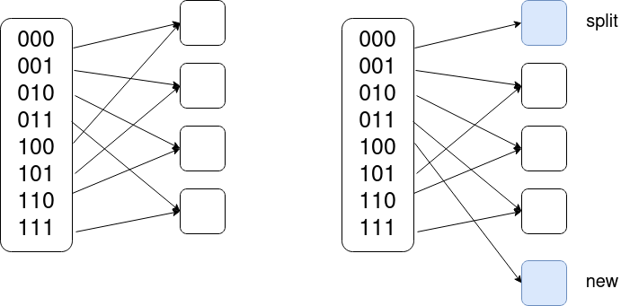

# Solutions

### Milestone 1 - Implementation

This folder is a solution to our hashtable interview question. The hash table is implemented as an array of linked lists. One optimization I made was that each node of the linked list holds multiple values rather than 1. This is more cache efficient since the array in each node is contiguous in memory and therefore each cacheline we load while searching through the linked list holds multiple values to check rather than 1, so we do fewer random reads in memory. 

### Milestone 2 - Resizing 

In this solution the hashtable size is set to be 1.3 times the size of the expected number of values. Ideally we would pick the next prime. When the hashtable is at >0.8 capacity we resize the hash table by doubling the size. To do this we allocate a new array of linked lists and iterate over the old inserting values into the new one. This is the naive solution as we need to copy everything.

An additional question to ask: Can you give an intuitive explanation to _why_ the average amortized cost of insertion is O(1) using this model?

Answer: This is O(1) amortized, since over the course of n insertions, the doublings cost 1 + 2 + 4 + 8 + 16 + ... + n/4 + n/2 + n. This sum, is ~= 2n. Thus the average cost over the n insertions is "2n/n", or O(1).

An additional question to ask: A reasonable way to implement resizing while removing items from the hashmap, is to halve the size of the hashmap when the number of elements drops below capacity/2. If a public API was given using this algorithm for removal and insertion, can you figure out a way to exploit this and slow down the server using a long sequence of O(n) operations?

Answer: By inserting up to a large power of 2, and then vibrating between 2^K+1 and 2^K-1, you keep doubling and halving the size of the hashmap over and over again, successfully DDOS'ing the server. Inseresting note: This is resolved by simply halving the size of the array when the number of elements drops below capacity/4.

### Milestone 3 - Original Question

You might note that in your solution to Milestone 2, every once in a while, an O(n) operation occurs. Even though it's amortized O(1), this can create a problem in some situations. Consider for example, a webserver that holds an internal hashmap with billions or trillions of records. Ideally, this webserver can respond to Insertion and Deleting API Requests very quickly, and handle many tens of thousands of API requests per second. However, with the model described in Milestone 2, if an unlucky resize occurs, the webserver could potentially become unresponsive for 5-10 seconds at a time. It's reasonable to consider this to be unacceptable performance in a production setting. Knowing this, how would you as engineer design a system to ensure that API Requests get low-latency responses (On the order of 1ms processing, not 5-10 seconds processing, even in the worst possible case). And, ensure that the algorithm utilizes RAM with at least 10-25% efficiency. I.e., simply allocating a 1 billion size hashmap for 1 million entries, isn't acceptable. The amount of the hashmap used versus the capacity of the hashmap, must be within a small constant factor. It should be explained why the solution is valid, and why it's O(1) even in the worst case.*

*Worst case, still assuming our hash function is sufficiently randomizing. I.e. it distributes Keys over the hashmap well, and buckets never get any larger than 5 or 6.

### Milestone 3 - First Potential Solution

Use a multithreaded technique. When our hashmap H needs to be increased in size, create a new hashmap of double the size named H'. The other thread should, in a loop, lock a mutex, and then move a Key, Value from H to H'. If Key is already in H', we drop the Value. When we Set(K, V), we lock the mutex and insert into only H'. When we Get(K), we lock the mutex, get from H' first, and then get from H second if the key is not in H', and return nothing if it's in neither.

Some care should be taken to ensure that starvation doesn't happen, it should be ensured that for every time a Get or Set happened, at least one iteration of the Loop in the other thread also happens. (A good note by @Karthick, very true! It's possible to code this up with a simple mutex, but get into a situation where we have so many Gets and Sets coming in that the other thread never ends up getting any CPU time)

### Milestone 3 - Second potential solution

When H has reached maximum capacity, we initialize a new hashmap H'.

- On Set(K, V), we remove K from H, we insert (K, V) into H', and move (2) entire buckets from H to H', and delete H if H is empty.
- On Get(K), we get from H' first, and then get from H if the key wasn't in H', return nothing if it was in neither (Optional: move (2) entire bucket from H to H' on Get() as well and then delete H if H is empty, though it's not necessary to do this step on Get's)

This works because the only way we could have filled up H', is by first having done enough insertions to have iterated over all of the buckets of H. Since H is of max size N capacity N\*1.3, and H' is of max size 2N capacity 2N\*1.3, The only way H' could reach max size, would be if N insertions occured. However, that would imply that 2N buckets have been moved. That means that H would have been wiped clean a long time ago (0.7\*N/2 insertions ago, to be precise). This implies that by the time H' needs to be resized, H is long gone, so H' can be the new H, and we can have a new H' of size 4N.

### Milestone 3 - Harvard example?

One approach is to use extendible hashing. With this technique we have a power of 2 number of bins. We have a mapping function which maps from hash values to to buckets, e.g an array of pointers. If we start by using the i last bits we have 2^i buckets and every hashed key ending in the same i bits points to the same bucket. When one of our buckets overflows we split it in two and begin using an additional bit by changing a pointer in the array to point to a new bucket. We then go key/value pair in the bucket and rehash it placing it either in the old bucket or the new bucket based on the additional bit. This approach incrementally expands the hash table one bucket at a time as required and therefore amortizes the cost over all insert operations. 

#### Example

This figure is a simplified example. We start by only using the last two bits of the hash. Every hashed key with the same last two bits points to the same bucket. Bucket 1 overflows and we need to add a new bucket. To do so we split it and use an additional bit so 000 points to the same bucket and 100 now points to a new bucket. We then go through the items in the original bucket and hash them again putting them in either bucket 1 or into bucket 5 based on the last 5 bits. 
